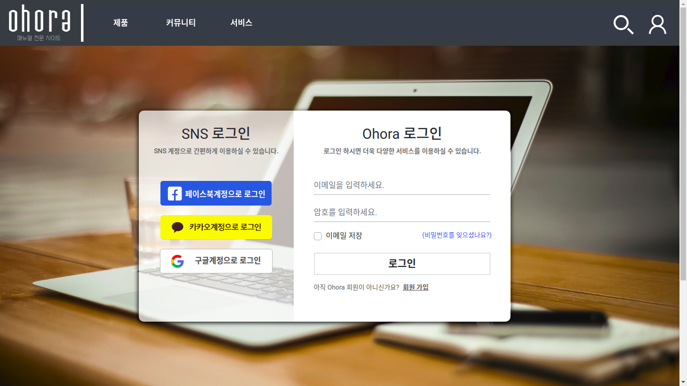
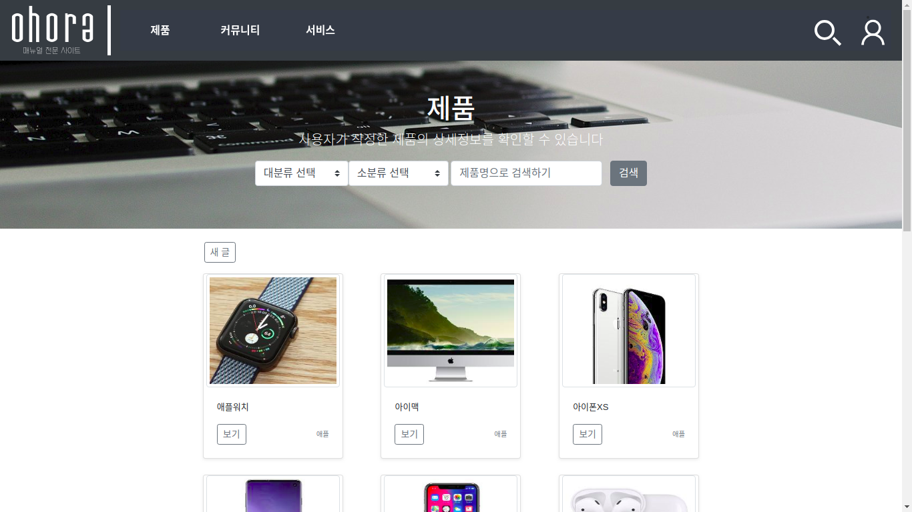

# Manual website
## 1. Introduction
</img>
</img>
</img>

**이 웹사이트는 특정 제품의 대한 정보, 매뉴얼, 리뷰, 팁 등을 쉽고 간편하게 찾아볼 수 있는 웹사이트 입니다.**

### Notification
- 개발기간 : 2019.05.06 ~ 2019.06.23 (약 2달)
- 팀 구성 : (저 포함) 4명
- UI프로토타입, DB모델링, use case를 보시려면 docs 폴더에 있습니다.
- 프로젝트 시연영상은 <https://www.youtube.com/watch?v=4UffCigsM84&t=401s> 입니다.
- 프로젝트는 MVC패턴2로 구현되었지만, JSP를 사용하지않고 Client가 Server에 AJAX로 요청하면 
  Dispatcher Servlet은 요청에 맞게 데이터를 뽑은 후 Browser에 JSON 형식으로 응답하고 
  Browser는 응답받은 JSON 데이터를 랜더링합니다.
---
## 2. Program Stacks
### Client
frontend technologies used in this project:
* html
* css (bootstrap)
* javascript(jquery)
* API (kakao, google, facbook login)
* etc.. 

### Server
backend technologies used in this project:
* java
* Apache Tomcat
* Spring
* Mybatis
* Maria DB

### Assist Tools
* Git
* Gradle
* npm
* VScode
* kakao Oven
* Exerd
* etc..
---
## 3. I've implemented these myself

