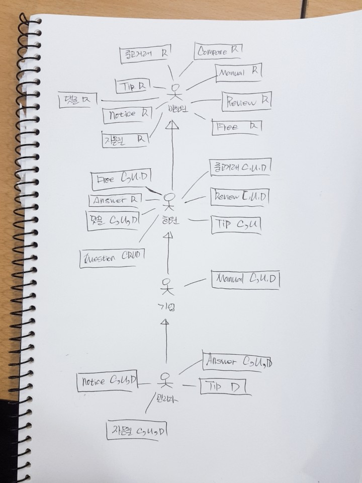

# 사용자가 손쉽게 제품의 정보(메뉴얼, 리뷰, 비교정보 등)를 조회할 수 있는 사이트

# 유스케이스

## Actors

### 비회원
- 시스템에 로그인 하지 않은 사용자
### 일반회원
- 시스템에 로그인 한 사용자
### 기업회원
- 기업회원으로 등록된 로그인 사용자
### 관리자
- 관리자로 등록된 로그인 사용자

## Use-Cases

### [로그인](로그인.md)(비회원)
- 비회원이 페이지에 로그인 하는 것

### [회원가입](회원가입.md)(비회원)
- 비회원이 로그인을 위해 회원에 가입하는 것.

### [회원탈퇴](회원탈퇴.md)(회원)
- 회원이 서비스에서 탈퇴하는 것.

### [검색하기](검색하기.md)(회원, 비회원)
- 회원또는 비회원이 등록된 게시물을 열람하기 위하여 검색하는 것

### [개인정보 관리](개인정보관리.md)(회원)
- 회원이 자신의 개인정보에 대해 등록, 조회, 수정, 삭제 하는것

### [메뉴얼 관리](메뉴얼관리.md)(기업)
- 기업 회원이 메뉴얼을 관리하는 것

### [중고거래 관리](중고거래관리.md)(회원)
- 회원이 중고거래 게시판에 대해 등록, 조회, 수정, 삭제 하는것
- 중고거래 게시판을 조회하는 것(비회원)

### [공지사항 관리](공지사항관리.md)(비회원, 회원, 관리자)
 - 공지사항을 등록, 수정, 삭제하는 것(관리자)
 - 공지사항을 조회하는 것(비회원, 회원)

### [리뷰 관리](리뷰관리.md)(회원, 비회원)
- 회원이 리뷰를 등록, 변경, 삭제, 추천, 비추천 신고 및 
  댓글 등록, 삭제하는 것
- 비회원이 리뷰를 조회하는 것

### [댓글 관리](댓글관리.md)(회원, 비회원)
 - 회원이 댓글을 등록, 조회, 수정, 삭제, 추천, 신고하는 것
 - 비회원이 댓글을 조회하는 것

### [컴페어 조회하기](컴페어조회.md)(비회원, 회원)
- 비회원 및 회원이 컴페어 조회기능을 이용하는 것.

### [질문답변 관리](질문답변관리.md)(회원, 관리자)
- 회원이 질문을 작성하는 것.
- 회원이 질문을 조회하는 것.
- 회원이 질문을 삭제하는 것.
- 관리자가 질문의 대해 답변을 등록하는 것.
- 관리자가 질문의 대해 답변을 수정하는 것.
- 관리자가 질문의 대해 답변을 삭제하는 것.

### [팁 관리](팁관리.md)(회원, 비회원)
- 회원이 팁을 등록, 조회, 수정, 삭제 하는 것
- 비회원은 조회만 가능하다

### [회원 및 게시물관리](회원및게시물관리.md)(관리자)
- 관리자가 회원을 제재하는 것
- 관리자가 승인대기 게시물 목록을 승인하는 것

--------------------------------------------------------------------------------------------------
### [매뉴얼 관리자 페이지](Joo-uc008-ManualAdmin.md)(관리자)
 - 관리자가 매뉴얼 페이지에서 매뉴얼이나 댓글을항 등록, 조회, 수정, 삭제하는 것

### [신고게시판 관리하기](woo-uc005-TipReportManagement.md)(관리자)
- 회원으로부터 신고가 들어온 내역 리스트를 열람하고 답변하고 제재, 롤백 것.
