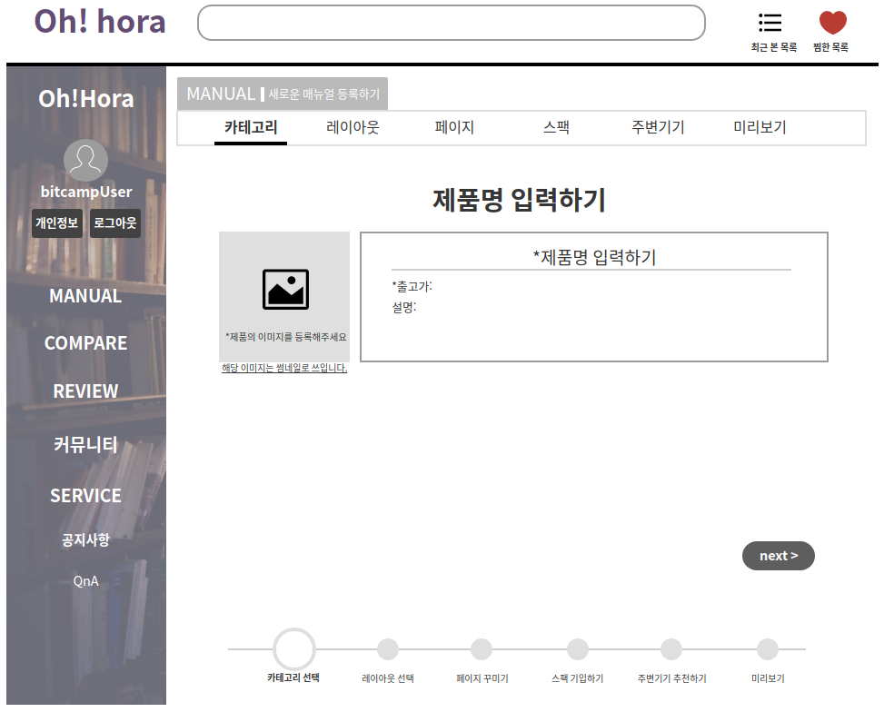
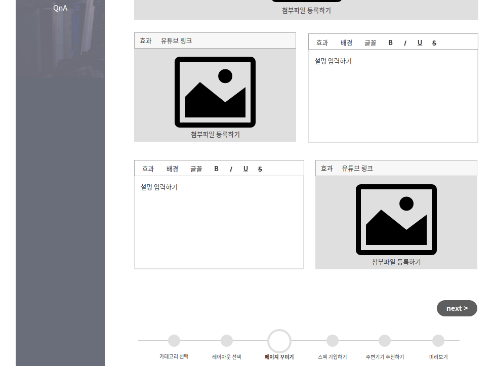
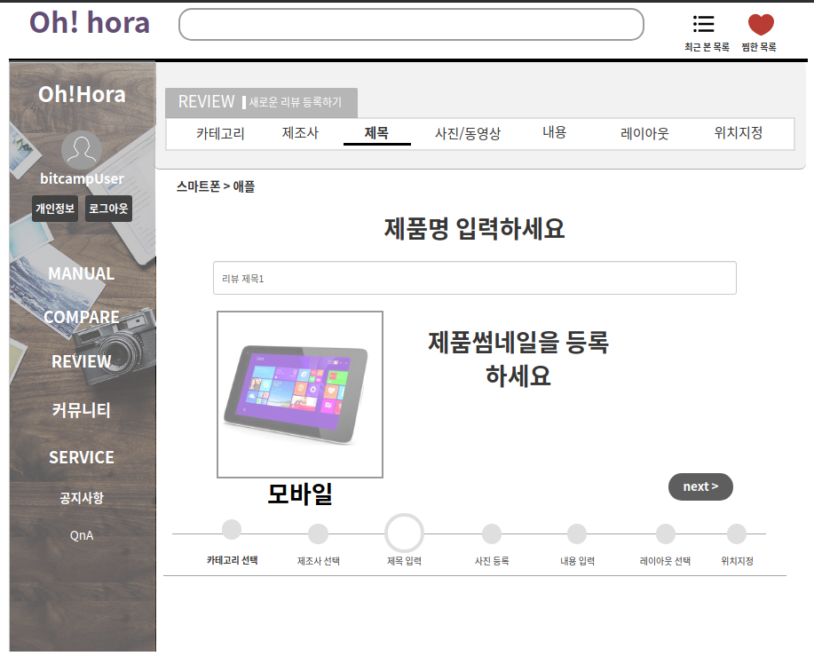
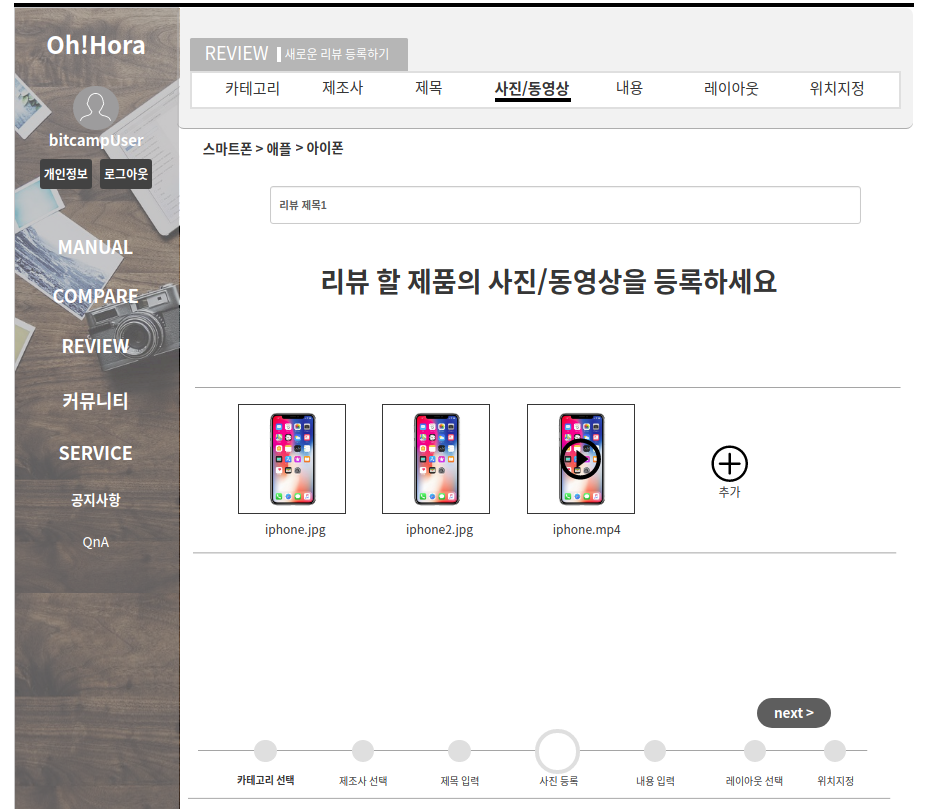

# 매뉴얼 관리
메뉴얼 게시판 항목을 등록, 조회, 변경, 삭제하는 유스케이스이다.

## 주 액터(Primary Actor)
기업, 관리자

## 보조 액터(Secondary Actor)

## 사전 조건(Preconditions)
- 게시판을 등록할 수 있는 이용자는 기업 또는 관리자 회원이다.
- 게시판에 동일한 제품의 매뉴얼이 등록되어 있지 않다.

## 종료 조건(Postconditions)
- 매뉴얼 정보가 매뉴얼 게시판에 등록 되었다.
- 매뉴얼 게시판 항목을 조회 하였다.
- 매뉴얼 정보가 수정 되었다.
- 매뉴얼 정보가 매뉴얼 게시판에 삭제 되었다

## 시나리오(Flow of Events)

### 메뉴얼 게시판 항목 등록하기
1. 액터가 새로운 매뉴얼 등록하기 버튼을 클릭할 때 이 유스케이스를 시작한다
2. 시스템은 '상위 카테고리' 선택란을 출력한다.
3. 액터는 상위 카테고리를 선택한 뒤 '다음' 버튼을 누른다.
4. 시스템은 '하위 카테고리' 선택란을 출력한다.
5. 액터는 하위 카테고리를 선택한 뒤 '다음' 버튼을 누른다.
6. 시스템은 '레이아웃' 선택란을 출력한다.
7. 액터는 레이아웃을 선택한 뒤 '다음' 버튼을 누른다
8. 시스템은 액터가 선택한 레이아웃을 출력한다.
9. 액터는 출력된 레이아웃에 맞춰 제목, 첨부파일, 설명을 입력한다.
    - 액터가 필수 입력 정보를 입력하지 않았다면,
        - 시스템은 필수 입력 항목이 비어있음을 알리는 내용을 출력한다.
10. 시스템은 액터가 입력한 값을 저장한 뒤, '스팩' 정보 기입란을 출력한다.
11. 액터는 스펙 정보를 입력한 뒤 '다음' 버튼을 누른다.
12. 시스템은 스펙 정보를 저장한 뒤 매뉴얼 등록 폼 중 '주변기기 등록'을 출력한다.
13. 액터는 주변기기 정보를 입력한 뒤 '저장하기' 버튼을 누른다.
14. 시스템은 해당 매뉴얼을 시스템에 저장한 뒤 '매뉴얼 조회하기' 유스케이스 중 2번 항목으로 돌아간다.

### 메뉴얼 게시판 항목 조회하기
1. 액터는 매뉴얼 메뉴를 클릭한다.
2. 시스템은 기본 매뉴얼 목록(매뉴얼 이름, 사진, 카테고리)을 출력한다.
3. 액터는 목록에서 매뉴얼 목록(매뉴얼 이름, 사진)을 선택한다
4. 시스템은 매뉴얼 상세 정보(이름, 첨부파일, 매뉴얼 설명, 스팩, 주변기기 목록, 댓글)를 출력한다

### 메뉴얼 게시판 항목 수정하기
1. 액터는 매뉴얼 상세조회 폼에 들어간다.
2. 시스템은 매뉴얼 디테일 목록(이름, 첨부파일, 내용, 기타정보)을 출력한다.
3. 액터는 상세조회 폼에서 '수정'버튼을 누른다
4. 시스템은 매뉴얼 상세 정보(이름, 첨부파일, 내용, 기타정보)를 출력한다
5. 기업 회원은 수정할 사항을 변경한 뒤 '변경' 버튼을 누른다
6. 시스템은 수정한 매뉴얼을 저장한 후, '매뉴얼 조회하기' 유스케이스의 2번 항목으로 돌아간다.

### 메뉴얼 게시판 항목 삭제하기
1. 액터는 매뉴얼 상세조회 폼에 들어간다.
2. 시스템은 매뉴얼 상세 목록(이름, 첨부파일, 첨부파일에 대한 설명, 스펙, 주변기기, 댓글)을 출력한다.
3. 액터는 메뉴얼 상세조회 폼에서 '삭제'버튼을 누른다.
4. 시스템은 해당 매뉴얼을 삭제한 후 '매뉴얼 조회하기' 유스케이스의 2번 항목으로 돌아간다.

### 매뉴얼 UI 프로토타입

