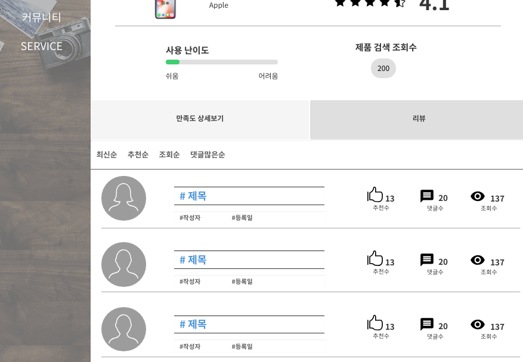

# UC002 - 리뷰조회

리뷰를 조회하는 유스케이스이다.

## 주 액터(Primary Actor)

비회원
 
## 보조 액터(Secondary Actor)

## 사전 조건(Preconditions)

- 비회원 상태이다.

## 종료 조건(Postconditions)

- 리뷰를 조회하였다.
 
## 시나리오(Flow of Events)
### 리뷰 조회하기

1. 액터는 카테고리1(제품 대분류)을 선택한다.
2. 시스템은 카테고리1에 맞는 카테고리2를 출력한다.
3. 액터는 카테고리2(제품 소분류)를 선택한다.
4. 시스템은 카테고리2에 맞는 제조사를 출력한다.
5. 액터는 제조사를 선택한다.
6. 시스템은 제품 목록을 출력한다.
  - 액터는 제품을 선택하거나 검색창에 제품명을 검색한다.
     - 제품명 입력 후 검색버튼을 누르면 시스템은 제품을 목록을 출력한다.
7. 액터는 제품을 선택한다.
8. 시스템은 제품 리뷰 페이지를 출력한다.
9. 액터는 리뷰 탭을 클릭한다.
10. 시스템은 사용자 리뷰 목록을 출력한다.
11. 액터는 리뷰 목록 중 하나를 선택한다.
12. 시스템은 상세 리뷰 창을 출력한다.

## 리뷰 

