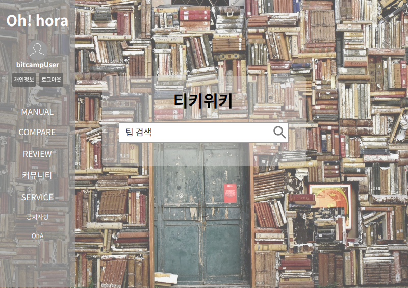
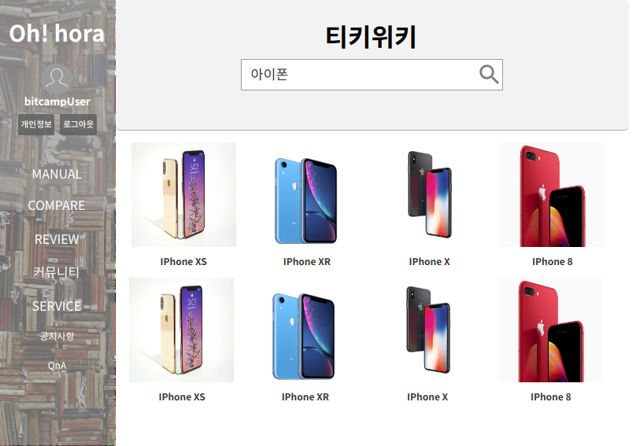

# UC001 - 팁 열람하기(TipDetail)
- 티키위키에 등록된 팁을 보는 것

## 주 액터(Primary Actor)
비회원

## 보조 액터(Secondary Actor)

## 사전 조건(Preconditions)
- 사용자가 티키위키 메뉴를 선택한다.

## 종료 조건(Postconditionse)
- 사용자가 티키위키에 등록된 팁을 본다.

## 시나리오(Flow of Events)

### 기본 흐름(Basic Flows)
1. Actor가 자유게시판에서 티키위키를 선택한다.
2. 시스템은 `티키위키 메인 폼`을 출력한다.
3. Actor가 검색창에 검색하고 싶은 제품을 검색한다.
2. 시스템은 `티키위키 리스트 폼`을 출력한다.
3. Actor는 자신이 보고싶은 제품을 선택한다.
4. 시스템은 검색어를 통해 그에 맞는 `팁 디테일 폼`을 출력한다.
5. Actor가 팁을 선택하여 본다.

## UI 프로토타입

### 티키위키 메인

### 티키위키 리스트

### 티키위키 디테일
