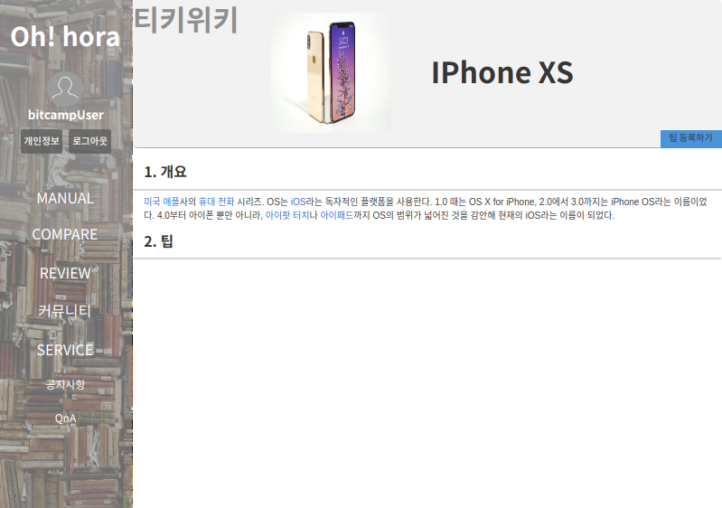
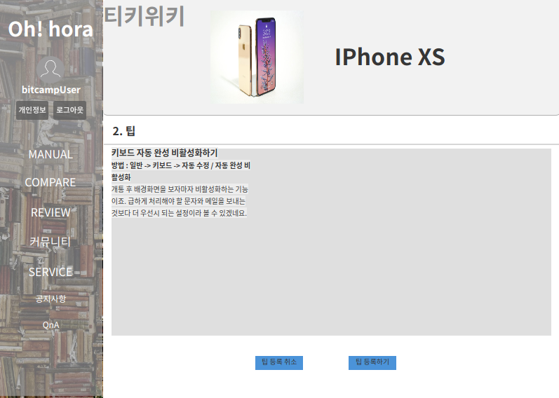
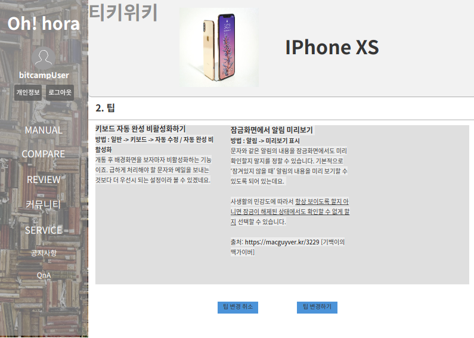
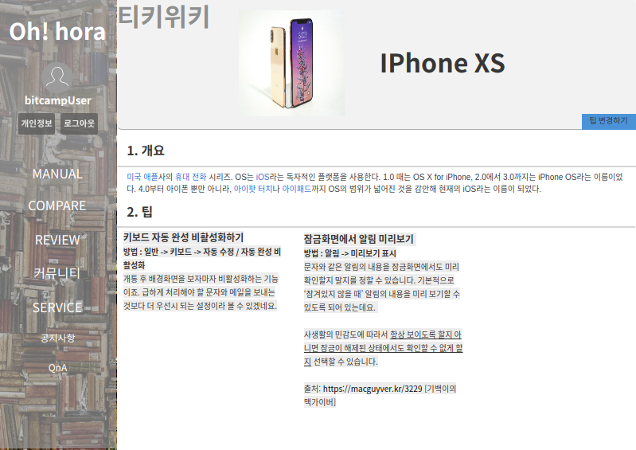

# UC002- 팁 관리(Tip Management)
팁을 등록, 변경하는 유스케이스이다.

## 주 액터(Primary Actor)
일반 유저

## 보조 액터(Secondary Actor)

## 사전 조건(Preconditions)
- 일반 유저로 로그인 되어있다.
- 팁을 등록할 때, 기존의 팁이 존재하지 않는다.
- 팁을 변경할 때, 기존의 팁이 존재한다.

## 종료 조건(Postconditionse)
- 팁을 등록하였다.
- 팁을 변경하였다.

## 시나리오(Flow of Events)

### **팁 등록하기** 의 기본 흐름(Basic Flows)
1. Actor가 `팁 등록하기` 버튼을 클릭한다.
2. 시스템은 `팁 등록 폼`을 출력한다.
3. Actor는 `팁 입력 창`에 자신만의 팁을 입력한다.
4. Actor가 팁을 모두 작성하고 `팁 등록` 버튼을 클릭한다.
5. 시스템은 일반 유저가 등록한 팁을 저장한 후 `팁 열람` 유스케이스 2번으로 이동한다.
  - 사용자가 `팁 등록 취소` 버튼을 눌렀다면,
    - 시스템은 `팁 열람` 유스케이스 2번으로 이동한다.
        
### **팁 변경하기** 의 기본 흐름
1. Actor가 `팁 변경하기` 버튼을 클릭한다.
2. 시스템은 `팁 변경 폼`을 출력한다.
3. Actor는 `팁 입력 창`에 자신만의 팁을 추가한다.
4. Actor가 팁을 모두 수정하고 `팁 변경` 버튼을 클릭한다.
5. 시스템은 일반 유저가 등록한 팁을 저장한 후 `팁 열람` 유스케이스 2번으로 이동한다.
  - 사용자가 `팁 변경 취소` 버튼을 눌렀다면,
    - 시스템은 `팁 열람` 유스케이스 2번으로 이동한다.

## UI 프로토타입

### 티키위키 디테일

### 티키위키 등록

### 티키위키 디테일 등록 후

### 티키위키 변경

### 티키위키 디테일 변경 후
