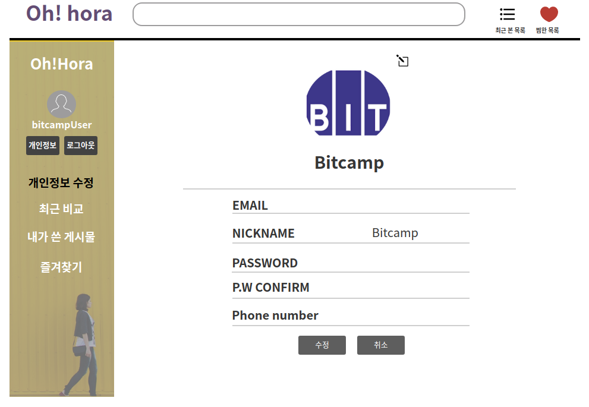
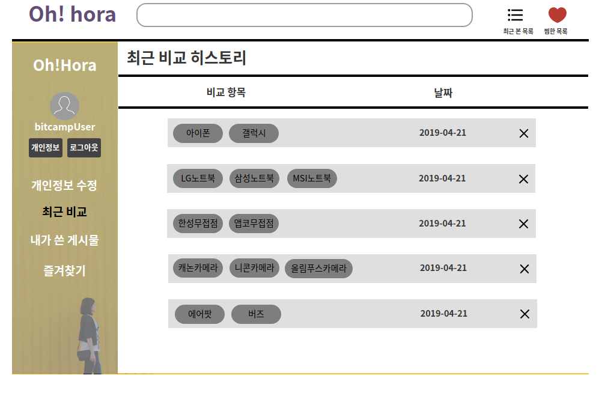
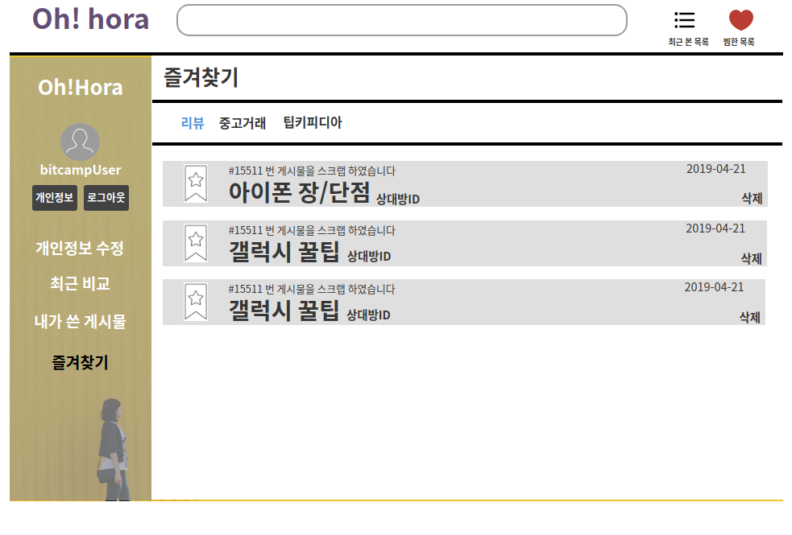

# 개인 정보 관리
- 회원이 자신의 개인정보에 대해 등록, 조회, 수정, 삭제하는 유스케이스이다.

## 주 액터(Primary Actor)
회원

## 사전 조건(Preconditions)
- 회원으로 로그인 되어있다.

## 종료 조건(Postconditions)
- 자신이 쓴 게시물(댓글, 리뷰, 메뉴얼 등)을 조회 하였다.
- 자신이 쓴 게시물(댓글, 리뷰, 메뉴얼 등)을 삭제 하였다.
- 자신이 쓴 게시물(댓글, 리뷰, 메뉴얼 등)을 변경 하였다.

## 시나리오(Flow of Events)

### 게시물 조회하기
1. 액터는 개인정보 페이지에서 '내가 쓴 게시물' 메뉴를 클릭한다.
2. 시스템은 해당 액터가 작성한 게시물을 목록을 보여준다.
  - 액터가 원하는 게시물 카테고리(댓글, 리뷰, 매뉴얼 등)을 선택한다면,
    - 시스템은 해당 게시물 카테고리에 맞는 게시물 목록을 출력한다.
3. 액터는 원하는 게시물 목록의 항목을 클릭한다.
4. 시스템은 해당 게시물의 상세 정보를 출력한다.

### 게시물 삭제하기
1. 액터는 개인정보 페이지에서 '내가 쓴 게시물' 메뉴를 클릭한다.
2. 시스템은 해당 액터가 작성한 게시물을 목록을 보여준다.
  - 액터가 원하는 게시물 카테고리(댓글, 리뷰, 매뉴얼 등)을 선택한다면,
    - 시스템은 해당 게시물 카테고리에 맞는 게시물 목록을 출력한다.
3. 액터는 게시물 항목의 삭제버튼을 클릭한다.
4. 시스템은 해당 게시물을 삭제했다는 메세지를 출력한다.
      
### 게시물 변경하기
1. 액터는 개인정보 페이지에서 '내가 쓴 게시물' 메뉴를 클릭한다.
2. 시스템은 해당 액터가 작성한 게시물을 목록을 보여준다.
  - 액터가 원하는 게시물 카테고리(댓글, 리뷰, 매뉴얼 등)을 선택한다면,
    - 시스템은 해당 게시물 카테고리에 맞는 게시물 목록을 출력한다.
3. 액터는 게시물 항목의 변경버튼을 클릭한다.
4. 시스템은 해당게시물의 '변경하기' 폼을 출력한다.
5. 액터는 수정할 사항을 변경한 뒤 '변경' 버튼을 누른다
  - 액터가 아무것도 수정하지 않았다면,
    - 시스템은 변경 항목이 없다는 메세지를 출력한다.
  - 게시물의 필수 입력 항목을 입력하지 않았다면,
    - 시스템은 필수 입력 항목이 입력하지 않았다는 메세지를 출력한다.

### 개인정보 UI 프로토타입

