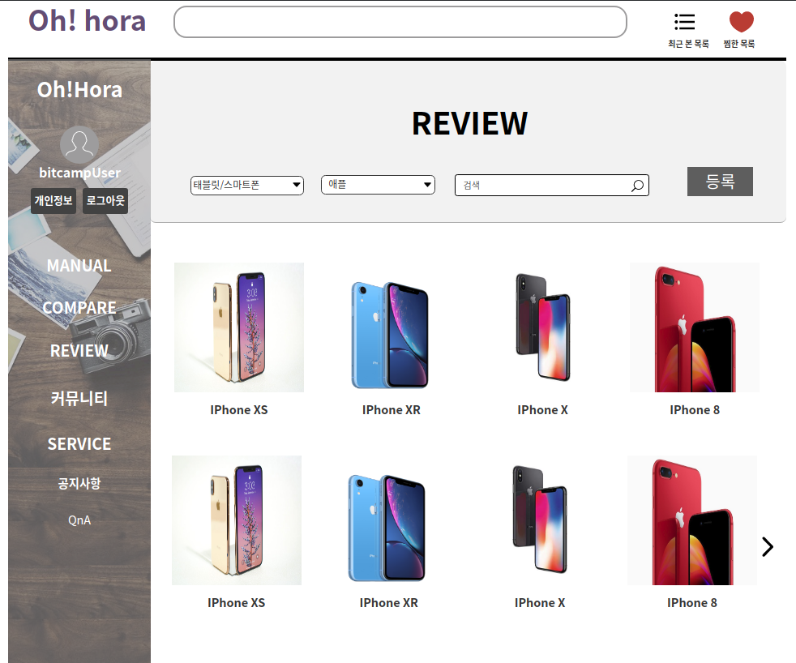
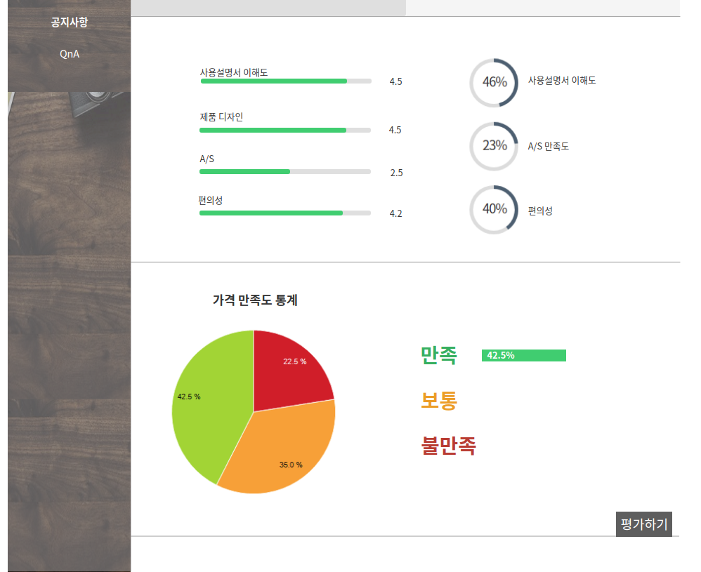
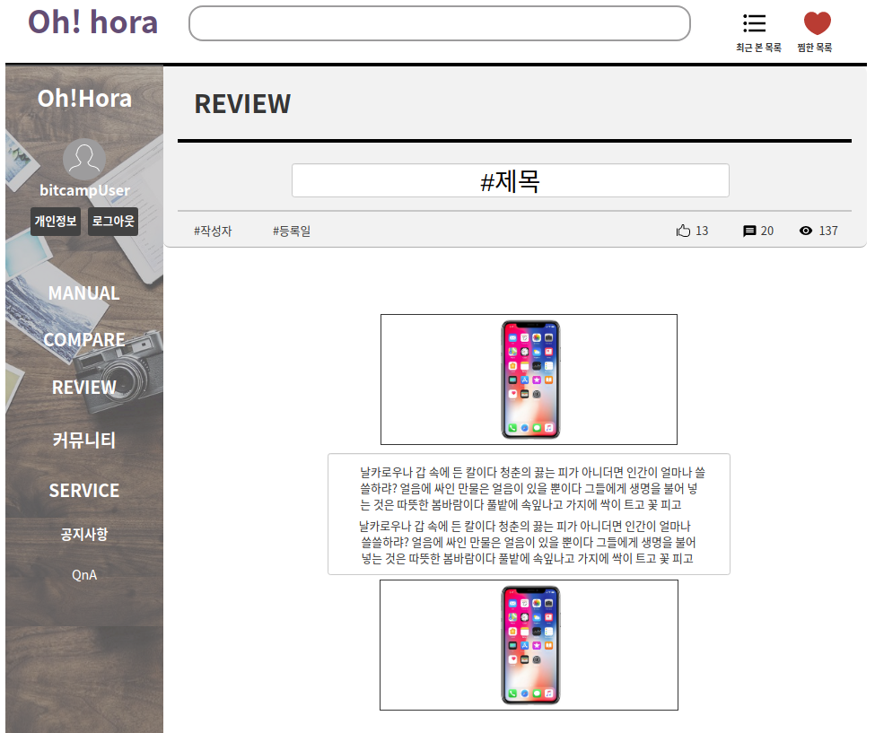
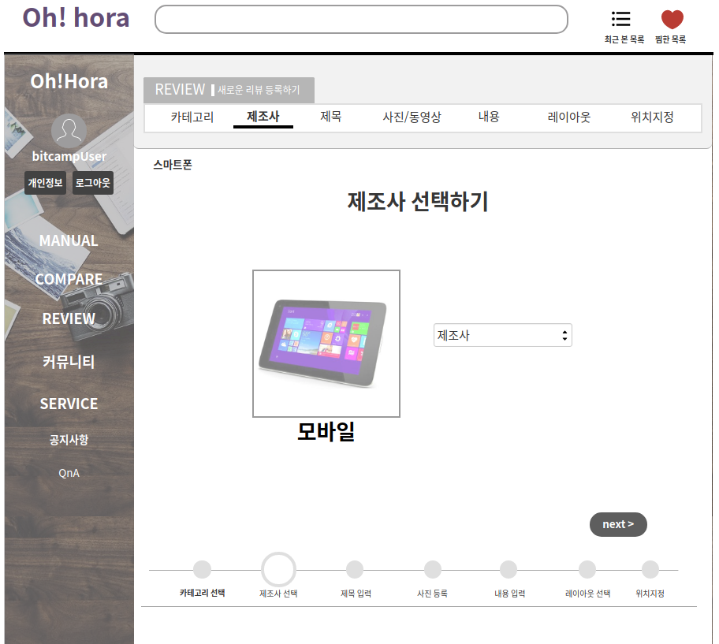
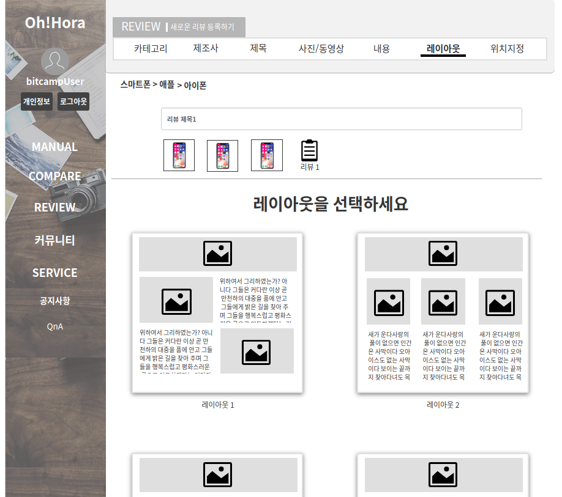
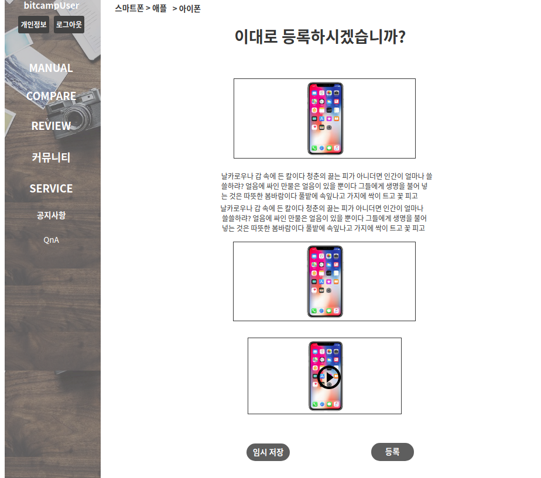

# 리뷰 관리하기
리뷰를 등록, 조회, 변경, 삭제, 추천, 비추천, 신고 및 제품을 평가하는 유스케이스이다.

## 주 액터(Primary Actor)
회원, 비회원

## 보조 액터(Secondary Actor)

## 사전 조건(Preconditions)
- 회원으로 로그인 되어있다.
- 비회원은 리뷰 조회만 가능하다
 
## 종료 조건(Postconditions)
- 리뷰를 등록하였다.
- 리뷰를 변경하였다.
- 리뷰를 삭제하였다.
- 리뷰를 추천하였다.
- 리뷰를 비추천하였다.
- 리뷰를 신고하였다.
- 제품을 평가하였다.

## 시나리오(Flow of Events)

### 리뷰 등록하기 (매뉴얼에 제품이 존재 할 때)
1. 액터는 리뷰 작성 버튼을 클릭한다.
2. 시스템은 리뷰 작성 폼(카테고리1 선택)을 출력한다.
3. 액터는 제품 카테고리1을 선택하고 다음으로 버튼을 클릭한다.
4. 시스템은 카테고리2 선택을 출력한다.
5. 액터는 카테고리2를 선택한다.
6. 시스템은 제조사 선택을 출력한다.
7. 액터는 제조사를 선택한다.
    - 필수 선택 항목(제품 카테고리 및 제조사)를 선택하지 않고 다음버튼을 누르면
      - 시스템은 항목이 선택되지 않음을 알린다.
8. 시스템은 제품 선택 폼을 출력한다.
9. 액터는 제품을 선택하고 다음으로 버튼을 클릭한다.
    - 필수 선택 항목(제품 선택)을 선택하지 않으면
      - 시스템은 항목이 선택되지 않음을 알린다.
10. 시스템은 제목 입력 폼을 출력한다.
11. 액터는 제목을 입력하고 다음으로 버튼을 클릭한다.
    - 필수 입력 항목(제목)을 입력하지 않고 '다음'버튼을 누르면
      - 시스템은 입력되지 않음을 알린다.
12. 시스템은 리뷰 사진 또는 동영상 추가 폼을 출력한다.
13. 액터는 사진 또는 동영상을 추가하고 '다음' 버튼을 클릭한다.
14. 시스템은 내용 입력 폼을 출력한다.
15. 액터는 내용을 입력하고 '다음' 버튼을 선택한다.
    - 내용2를 추가하려면 '+' 버튼을 눌러 추가 등록한다.
    - 필수 입력 항목(내용)을 입력하지 않고 '다음' 또는 '+' 버튼을 누르면 
       - 시스템은 입력되지 않음을 알린다.
16. 시스템은 레이아웃 선택을 출력한다.
17. 액터는 레이아웃을 선택하고 '다음' 버튼을 클릭한다.
18. 시스템은 레이아웃 및 폼 위치 지정 폼을 출력한다.
19. 액터는 폼 위치를 지정 후 '완료' 버튼을 클릭한다.
20. 시스템은 최종 확인 창을 출력한다.
21. 액터는 '올리기' 버튼을 클릭한다.
    - 임시 저장을 원한다면, 임시저장 버튼을 클릭한다.
22. 임시저장 버튼을 클릭하면 임시 저장 완료 폼을 띄우고,
    시스템은 현재까지 정보를 저장한다.
23. 올리기 버튼을 클릭하면 시스템은 '등록완료'를 출력한 후,
    '리뷰 조회하기' 유스케이스의 8번으로 간다.
    
### 리뷰 등록하기 (매뉴얼에 제품이 없을 때)
1. 액터는 리뷰 조회하기 6번에 출력할 제품(즉 메뉴얼에 등록된 제품이 아님)이 없을 시, 
   '등록'버튼을 클릭한다.
2. 시스템은 1번에서 선택한 카테고리에 해당하는 메뉴얼 등록창을 출력한다.
   (제품명 및 썸네일 사진 등록 폼)
3. 액터는 제품명 및 썸네일 사진을 입력하고 '다음'버튼을 클릭한다.
4. 리뷰 등록하기( 메뉴얼에 제품이 존재할 때)의 10번으로 간다.

### 리뷰 조회하기
1. 액터는 카테고리1(제품 대분류)을 선택한다.
2. 시스템은 카테고리1에 맞는 카테고리2를 출력한다.
3. 액터는 카테고리2(제품 소분류)를 선택한다.
4. 시스템은 카테고리2에 맞는 제조사를 출력한다.
5. 액터는 제조사를 선택한다.
6. 시스템은 제품 목록을 출력한다.
7. 액터는 제품을 선택하거나 검색창에 제품명을 검색한다.
8. 제품명 입력 후 검색버튼을 누르면 시스템은 제품을 목록을 출력한다.
9. 액터는 제품을 선택한다.
10. 시스템은 제품 리뷰 페이지를 출력한다.
11. 액터는 리뷰 탭을 클릭한다.
12. 시스템은 사용자 리뷰 목록을 출력한다.
13. 액터는 리뷰 목록 중 하나를 선택한다.
14. 시스템은 상세 리뷰 창을 출력한다.

### 리뷰 변경하기
1. 액터는 리뷰 상세 정보 화면에서 '수정'버튼을 클릭한다.
2. 시스템은 리뷰 변경 페이지를 출력한다.
3. 액터는 제목, 첨부파일, 내용을 변경하고 '수정'버튼을 클릭한다.
4. 시스템은 리뷰 정보를 변경한 후 '리뷰 조회하기' 유스케이스의 
   8번으로 간다.
    - 필수 입력 항목(제목, 내용)이 비어 있다면
      - 시스템은 필수 입력 항목이 비어있음을 알린다.
    - 첨부파일 용량을 초과한다면
      - 시스템은 첨부파일 용량이 초과되었음을 알린다.

### 리뷰 삭제하기
1. 액터는 리뷰 상세 정보 화면에서 '삭제'버튼을 클릭한다.
2. 시스템은 '삭제 하시겠습니까?' 폼을 띄운다.
3. 액터는 '네' 버튼을 클릭한다.
4. 시스템은 리뷰 정보를 삭제한 후 '리뷰 조회하기' 유스케이스의 6번으로 간다.
   
### 리뷰 추천
1. 액터는 '리뷰 조회하기' 유스케이스 8번의 '추천' 버튼을 누른다. 
    - 중복 선택하면
      - 시스템은 중복선택임을 알린다.
2. 시스템은 추천수를 1 올리고 합산된 추천수를 출력한다.

### 리뷰 비추천
1. 액터는 '리뷰 조회하기' 유스케이스 8번의 '비추천' 버튼을 누른다. 
    - 중복 선택하면
      - 시스템은 중복선택임을 알린다.
2. 시스템은 추천수를 1 내리고 합산된 추천수를 출력한다.
   
### 리뷰 신고하기
1. 액터는 '리뷰 조회하기' 유스케이스 8번의 '신고' 버튼을 누른다. 
2. 시스템은 신고 내용 입력 창을 출력한다.
3. 액터는 신고 제목, 내용을 입력 후 '신고'버튼을 누른다.
    - 필수 입력 항목(제목, 내용)을 입력하지 않으면
      - 시스템은 필수 입력 항목이 입력되지 않음을 알린다.

### 제품 평가하기
1. 액터는 '리뷰 조회하기' 유스케이스 4번의 '평가하기' 버튼을 누른다.
2. 시스템은 평가하기 창을 출력한다.
3. 액터는 (사용설명서 이해도, 제품 디자인, A/S, 편의성, 가격 만족도)를 
   평가 후 확인 버튼을 누른다.
    - 필수 입력 항목(사용설명서 이해도, 제품 디자인, A/S, 편의성, 가격 만족도)
      을 입력하지 않으면 
        - 시스템은 필수 입력 항목이 입력되지 않음을 알린다.
4. 시스템은 '리뷰 조회하기' 유스케이스 4번을 출력한다.

### 리뷰 UI 프로토타입

