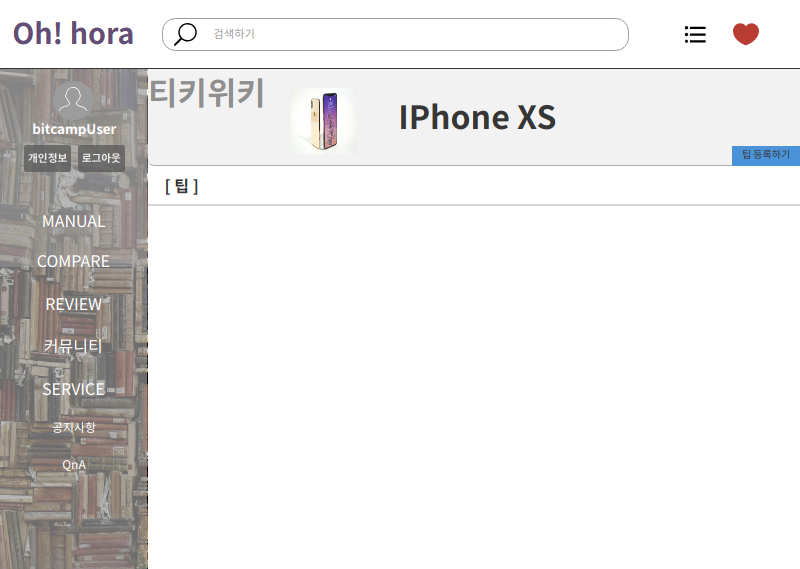
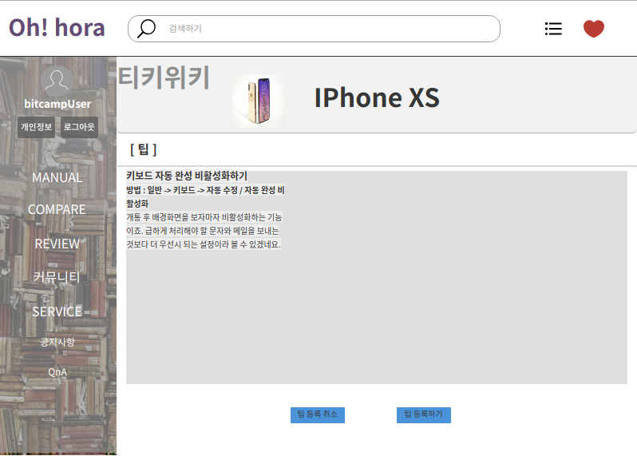
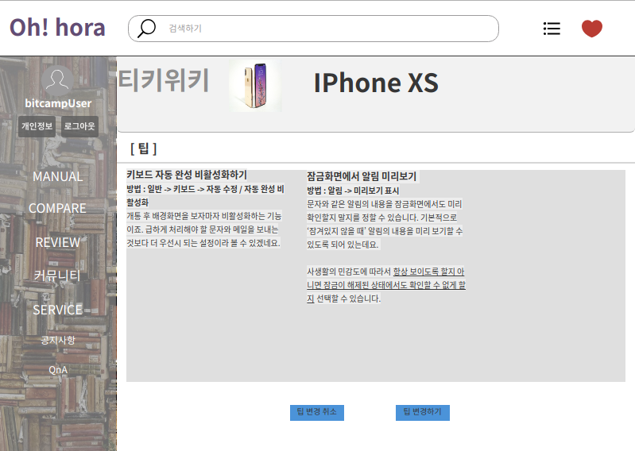

# 팁 관리
팁을 등록, 조회, 수정, 신고하는 유스케이스이다.

## 주 액터(Primary Actor)
회원. 비회원

## 보조 액터(Secondary Actor)

## 사전 조건(Preconditions)
- 회원으로 로그인 되어있다.
- 팁을 등록할 때, 기존의 팁이 존재하지 않는다.
- 팁을 변경할 때, 기존의 팁이 존재한다.
- 비회원은 조회만 가능하다.

## 종료 조건(Postconditionse)
- 팁을 등록하였다.
- 팁을 조회하였다.
- 팁을 변경하였다.
- 팁을 신고하였다.

## 시나리오(Flow of Events)

### 팁 등록하기
1. 액터는 팁 등록하기 버튼을 클릭한다.
2. 시스템은 팁 등록 폼을 출력한다.
3. 액터는 팁 입력 창에 자신만의 팁을 입력한다.
4. 액터는 팁을 모두 작성하고 팁 등록 버튼을 클릭한다.
5. 시스템은 일반 유저가 등록한 팁을 저장한 후 팁 열람 유스케이스 2번으로 이동한다.
  - 사용자가 팁 등록 취소 버튼을 눌렀다면,
    - 시스템은 팁 열람 유스케이스 2번으로 이동한다.
        
### 팁 조회하기
1. 액터는 자유게시판에서 티키위키를 선택한다.
2. 시스템은 티키위키 메인 폼을 출력한다.
3. 액터는 검색창에 검색하고 싶은 제품을 검색한다.
2. 시스템은 티키위키 리스트 폼을 출력한다.
3. 액터는 자신이 보고싶은 제품을 선택한다.
4. 시스템은 검색어를 통해 그에 맞는 팁 디테일 폼을 출력한다.
5. 액터는 팁을 선택하여 본다.

### 팁 변경하기
1. 액터는 팁 변경하기 버튼을 클릭한다.
2. 시스템은 팁 변경 폼을 출력한다.
3. 액터는 팁 입력 창에 자신만의 팁을 추가한다.
4. 액터는 팁을 모두 수정하고 팁 변경 버튼을 클릭한다.
5. 시스템은 일반 유저가 등록한 팁을 저장한 후 팁 열람 유스케이스 2번으로 이동한다.
  - 사용자가 팁 변경 취소 버튼을 눌렀다면,
    - 시스템은 팁 열람 유스케이스 2번으로 이동한다.

### 팁 신고하기
1. 액터는 광고성 글이나 현재 팁과는 적절치 않은 글을 발견했을 때 이 유스케이스를 시작한다.
2. 액터는 신고하기 버튼을 클릭한다.
3. 시스템은 신고 등록 폼을 출력한다.
4. 액터는 신고 등록 폼에 신고 내용을 기입한다.
5. 시스템은 액터는 입력한 신고 내용을 확인할 수 있는 신고 내용 확인 창을 띄운다.
6. 액터는 신고하기 버튼을 클릭하면, 시스템은 액터는 입력한 신고 내용을 저장하고 '팁 조회하기' 2번으로 이동한다.
  - 액터는 취소하기버튼을 클릭하면, 시스템은 '팁 조회하기' 2번으로 이동한다.

## UI 프로토타입

### 티키위키 디테일

### 티키위키 등록

### 티키위키 디테일 등록 후

### 티키위키 변경

### 티키위키 디테일 변경 후

